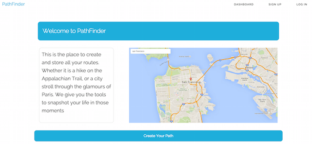
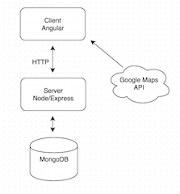

# Breezy-Pickles

> Plan a custom route to save and share.


## Team

  - __Product Owner__: Kimberly Ha
  - __Scrum Master__: CJ Apel
  - __Development Team Members__: Andrew Deal, Tracy Duong

## Table of Contents

1. [Usage](#Usage)
1. [Requirements](#requirements)
1. [Development](#development)
    1. [Installing Dependencies](#installing-dependencies)
    1. [Tasks](#tasks)
1. [Team](#team)
1. [Architecture](#Architecture)

## Architecture


## Usage


## Requirements

  - "angularjs": "0.0.1",
  - "bcrypt-nodejs": "0.0.3",
  - "body-parser": "^1.14.1",
  - "bower": "^1.6.5",
  - "express": "^4.13.3",
  - "mongoose": "^4.2.5",
  - "path": "^0.12.7",
  - "url": "^0.11.0",
  - "angular": "~1.4.7",
  - "skeleton": "~2.0.4",
  - "bootstrap": "~3.3.5",
  - "angular-route": "~1.4.7",

## Development

### Installing Dependencies

From within the root directory:
```sh
sudo npm install -g bower
npm install
bower install
```

### Local Database Setup
#### Install MongoDb
```sh
brew update
brew install mongodb
```
####Run MongoDB
Create data directory from root directory:
```sh 
mkdir -p /data/db
```
Run from data directory:
```sh 
mongod
```
OR 

Specify path of data directory if default data directory not used:
```sh 
mongod --dbpath <path to directory>
```

#### Start server
```sh
node server/server.js
```
